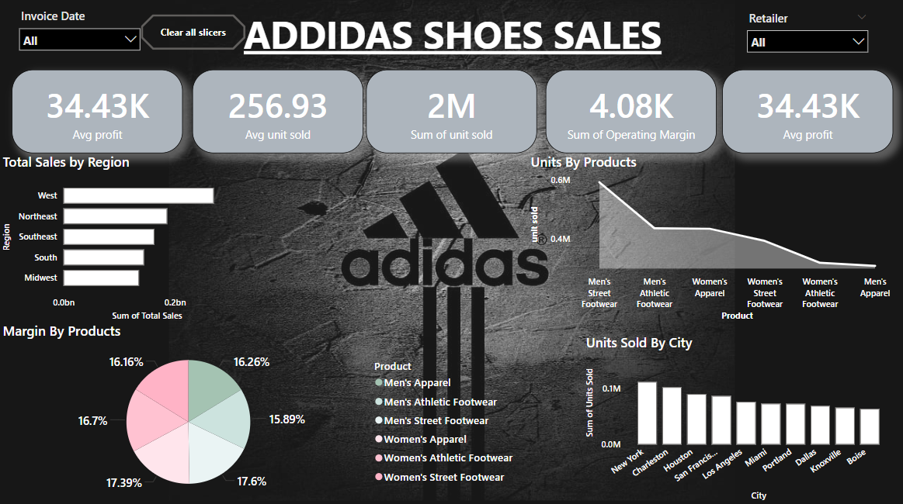

# Adidas Sales Analysis Project

  
*A visualization of Adidas sales analysis dashboard.*

## Overview
Conducted a detailed analysis of Adidas sales data to uncover key insights and optimize business strategies:  
- **Promotional Campaigns**: Evaluated effectiveness and trends in customer purchasing behavior.  
- **Regional Performance**: Designed an interactive dashboard to visualize sales performance by region.  
- **Customer Segmentation**: Analyzed demographics contributing to significant revenue.

## Tools and Technologies
- **Programming Languages**: SQL  
- **Data Visualization**: Power BI  

## Key Achievements
1. **Promotional Campaign Insights**: Identified trends that contributed to a **15% increase in sales** during active campaigns.  
2. **Supply Chain Optimization**: Improved distribution strategies, leading to a **10% boost in supply chain efficiency**.  
3. **Revenue Impact**: Segmented customer data revealed key demographics contributing to **20% of total revenue**, enabling targeted marketing initiatives.

## Outcome
The analysis empowered Adidas to refine its marketing and distribution strategies, enhancing sales performance and operational efficiency.  
